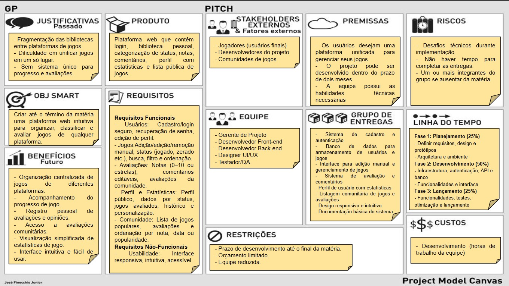
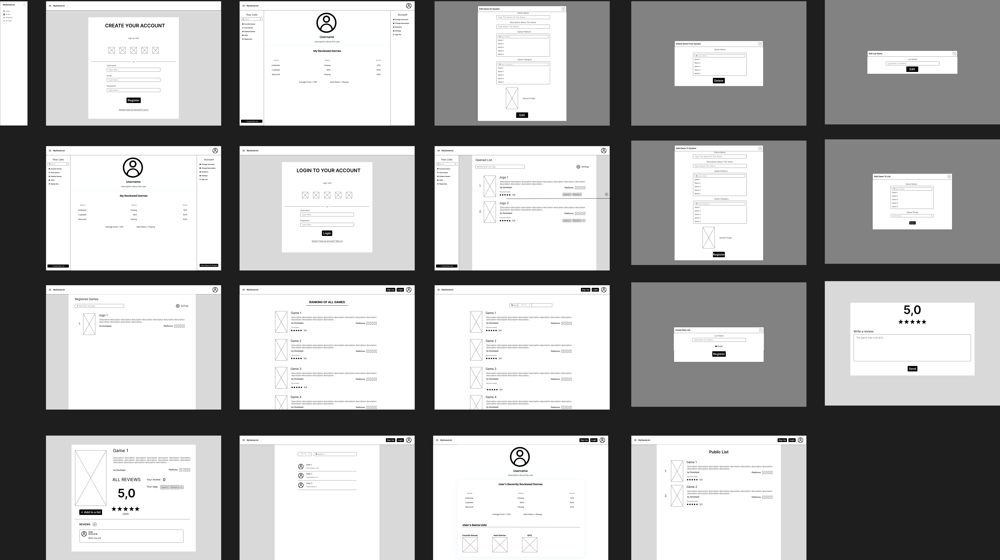
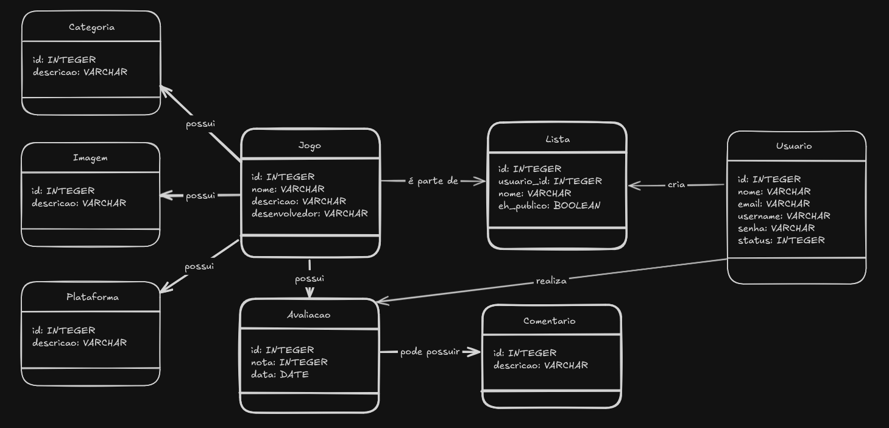
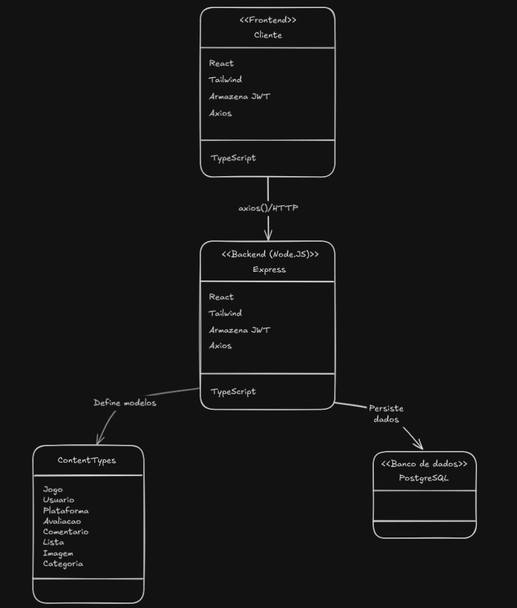

# 📘 Documentação do Projeto - Desenvolvimento Web

---

## 🧾 Visão Geral

Este projeto busca o desenvolvimento de um sistema de jogos, permitindo a classificação de diferentes jogos em diferentes listas. O sistema também permite a avaliação dos usuários em jogos, bem como a possibilidade de compartilhar publicamente listas criadas por um usuário.

---

## ✅ Backlog

| ID    | Prioridade | História de Usuário                                                                 |
|-------|------------|--------------------------------------------------------------------------------------|
| HU-1  | 1️⃣         | **No papel de cliente**, desejo **visualizar uma lista de jogos com imagem e descrição**, para poder escolher o que desejo jogar ou avaliar. |
| HU-2  | 2️⃣         | **No papel de cliente**, desejo **filtrar jogos por nome ou plataforma**, para encontrar mais rapidamente o que procuro. |
| HU-3  | 3️⃣         | **No papel de cliente**, desejo **organizar os jogos por nome ou por nota**, para descobrir novos jogos. |
| HU-4  | 4️⃣         | **No papel de cliente**, desejo **visualizar os itens na minhas listas**, para criar listas parsonalizadas. |
| HU-5  | 5️⃣         | **No papel de cliente**, desejo **remover ou alterar os jogos na minha lista**, para ajustar minhas organizações. |
| HU-6  | 6️⃣         | **No papel de cliente**, desejo **avaliar jogos com comentário e nota**, para expressar minha opinião aos outros usuários. |
| HU-7  | 7️⃣         | **No papel de cliente**, desejo **ver o perfil de outros usuários**, para saber os gostos de pessoas que eu conheço. |
| HU-8  | 8️⃣         | **No papel de cliente**, desejo **me autenticar com login e senha**, para acessar minhas listas privadas. |
| HU-9  | 9️⃣         | **No papel de administrador**, desejo **adicionar e apagar jogos**, para atualizar a lista de jogos disponiveis. |
| HU-10 | 🔟         | **No papel de administrador**, desejo **modificar as informações de jogos**, para corrigi-las. |

---

## 🎨 Protótipo de Telas

Cada funcionalidade descrita no backlog possui ao menos uma tela representando sua interface esperada.

### 🖼️ Telas dos requisitos

Todas as telas do sistema, também pode ser acessado pelo [figma](https://www.figma.com/design/cRnFYRXjhWQQ9i7eRKHfJk/Dev-Web-Prototype?node-id=0-1&t=6eKfZmTnOznsbiQ4-1).

---

## 🏗 Análise e Projeto 

O projeto  do sistema 

### Modelo 

### Esboço da arquitetura geral (cliente-servidor)

### Tecnologias a serem utilizadas
Node.js, React, PostgreSQL, TypeScript

---

### Telas do sistema

**Figura 2**: Tela de listagem de produtos com imagem, nome e preço — correspondente à história de usuário HU-1.

