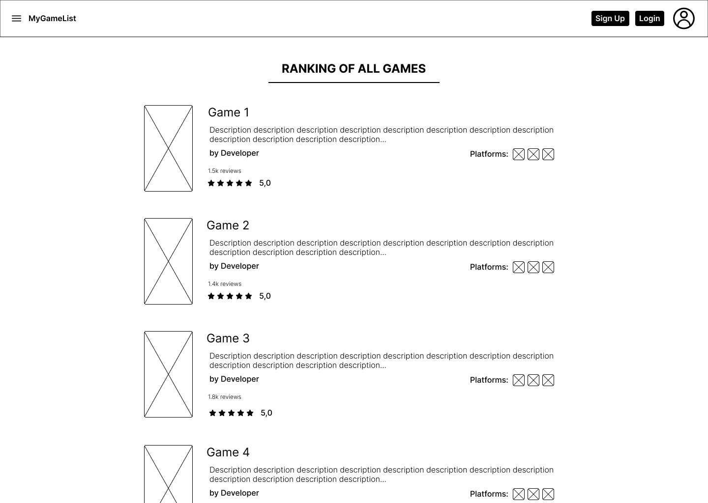
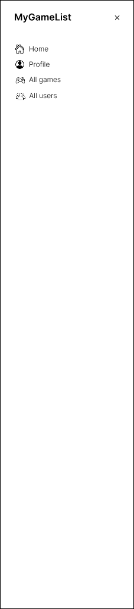

# 📘 Documentação do Projeto - Desenvolvimento Web

---

## 🧾 Visão Geral

Este projeto busca o desenvolvimento de um sistema de jogos, permitindo a classificação de diferentes jogos em diferentes listas. O sistema também permite a avaliação dos usuários em jogos, bem como a possibilidade de compartilhar publicamente listas criadas por um usuário.

---

## ✅ Backlog

| ID    | Prioridade | História de Usuário                                                                 |
|-------|------------|--------------------------------------------------------------------------------------|
| HU-1  | 1️⃣         | **No papel de usuário**, desejo **ver a home page**, para ver os jogos mais avaliados e navegar em todas as funcionalidades do sistema. |
| HU-1  | 2️⃣         | **No papel de administrador**, desejo **adicionar e apagar jogos**, para atualizar a lista de jogos disponiveis. |
| HU-2  | 3️⃣         | **No papel de administrador**, desejo **modificar as informações de jogos**, para corrigi-las. |
| HU-3  | 4️⃣         | **No papel de cliente**, desejo **me autenticar com login e senha**, para acessar minhas listas privadas. |
| HU-4  | 5️⃣         | **No papel de cliente**, desejo **visualizar e pesquisar numa lista de jogos com imagem e descrição**, para poder escolher o que desejo jogar ou avaliar. |
| HU-6  | 6️⃣         | **No papel de cliente**, desejo **avaliar jogos com comentário e nota e adicioná-lo a minha lista**, para expressar minha opinião aos outros usuários. |
| HU-7  | 7️⃣         | **No papel de cliente**, desejo **criar uma nova lista**, para organizar meus jogos. |
| HU-8  | 8️⃣         | **No papel de cliente**, desejo **visualizar os itens na minhas listas**, para criar listas parsonalizadas. |
| HU-9  | 9️⃣         | **No papel de cliente**, desejo **remover ou alterar os jogos na minha lista**, para ajustar minhas organizações. |
| HU-10  | 🔟         | **No papel de cliente**, desejo **ver o perfil de outros usuários**, para saber os gostos de pessoas que eu conheço. |

---

## 🎨 Protótipo de Telas

Cada funcionalidade descrita no backlog possui ao menos uma tela representando sua interface esperada.

### 🖼️ Protótipo do Requisito HU-1

**Figura 1**: Tela contendo o menu lateral do sistema, com opções de navegação para as diferentes funcionalidades.

### 🖼️ Protótipo do Requisito HU-2

.png)

**Figura 1**: Tela contendo o perfil do usuário administrador, com um botão para entrar na tela de administração de jogos.
**Figura 2**: Tela de administração de jogos, onde o administrador pode ver todos os jogos cadastrados no sistema e remover cada um.
**Figura 3**: Tela para adicionar um novo jogo ao sistema, onde o administrador pode inserir as informações do jogo.

### 🖼️ Protótipo do Requisito HU-3

**Figura 1**: Tela para editar as informações de um jogo já cadastrado no sistema, permitindo ao administrador corrigir ou atualizar os dados do jogo.

### 🖼️ Protótipo do Requisito HU-4

**Figura 1**: Tela de login do usuário, onde o cliente pode inserir suas credenciais para acessar o sistema.
**Figura 2**: Tela de cadastro de usuário, onde o cliente pode criar uma nova conta.
**Figura 3**: Tela de perfil do usuário comum, onde o cliente pode ver suas informações e acessar suas listas.

### 🖼️ Protótipo do Requisito HU-5

**Figura 1**: Tela de visualização de jogos, onde o cliente pode ver uma lista de jogos com suas imagens e descrições, além de opções para filtrar por nome ou plataforma.

### 🖼️ Protótipo do Requisito HU-6

**Figura 1**: Tela modal que aparece ao clicar em um jogo, mostrando detalhes do jogo selecionado.
**Figura 2**: Tela modal para adicionar uma avaliação ao jogo selecionado, onde o cliente pode inserir um comentário e uma nota.

### 🖼️ Protótipo do Requisito HU-7

**Figura 1**: Tela para criar uma nova lista, onde o cliente pode nomear e descrever sua lista de jogos.

### 🖼️ Protótipo do Requisito HU-8 e HU-9

**Figura 1**: Tela para ver as listas do usuário, mostrando todas as listas criadas pelo cliente.
**Figura 2**: Tela para editar o nome de uma lista existente, permitindo ao cliente personalizar suas listas.
**Figura 3**: Tela para adicionar jogos a uma lista específica, onde o cliente pode selecionar jogos para incluir em sua lista personalizada.

### 🖼️ Protótipo do Requisito HU-10

**Figura 1**: Tela para ver o perfil de outro usuário, onde o cliente pode visualizar as listas públicas de outros usuários e suas avaliações.

---

## 🏗 Análise e Projeto 

O projeto  do sistema 

### Modelo 

### Esboço da arquitetura geral (cliente-servidor)

### Autorização e autenticação

A autorização e autenticação será realizada utilizando Express.js e banco de dados, porém também haverá a possibilidade de entrar utilizando a conta Google, para isso iremos utilizar API própria do Google.

Serão definidos middlewares que não permitiram que usuários com perfis indevidos acessem partes da aplicação que não deveriam acessar.

### Tecnologias a serem utilizadas
Node.js, React, PostgreSQL, TypeScript

---

